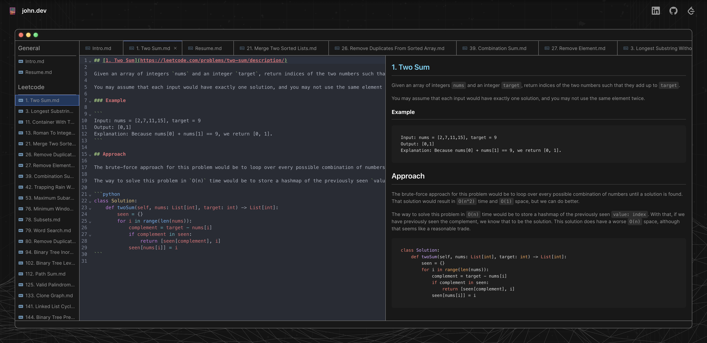

# [johnmayou.com](https://www.johnmayou.com)

A full-stack personal site and portfolio workspace to organize my written markdown content on a hosted website. The UI is designed like an IDE (like VSCode), featuring an HTML preview powered by a custom Markdown-to-HTML compiler.

## Highlights

- Ensured visual and functional correctness by implementing a comprehensive test suite across frontend (Jest, React Testing Library, Playwright) and backend (Go) unit, integration and end-to-end tests.
- Improving deployment reliability by building a CI/CD pipeline with pre-deploy health checks using GitHub Actions, Docker, and Terraform.
- Enabled real-time usage observability and uptime monitoring by integrating Prometheus and Grafana.

## Tech

**Next.js**, **React.js**, **TypeScript**, **Go (Golang)**, **Ruby**

## Preview

